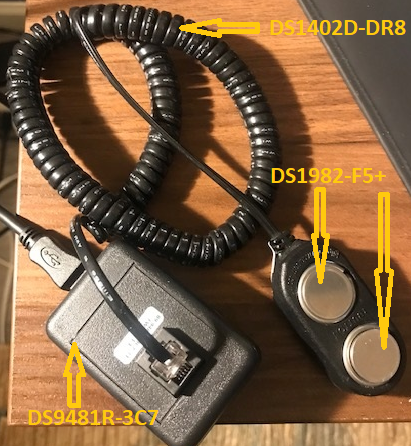
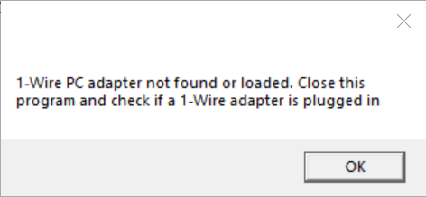
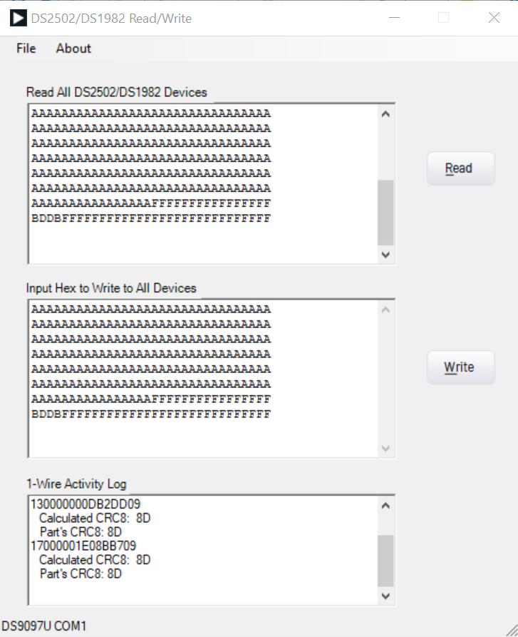

## Description

This is a C# graphical user interface (GUI) for Windows 10 x64, specifically to read and write the [DS2502](https://www.analog.com/en/products/DS2502.html#product-overview)  and the  [DS1982](https://www.analog.com/en/products/DS1982.html) (which is a DS2502-equivalent device in an iButton form factor) 1-Wire/iButton EPROM memory devices. 

## Hardware Requirements
-	A DS2502 chip (TO92 package), or a DS1982 iButton device are good/easy choices as off-the-shelf accesories exist to help program these devices. This software reads or writes multiple devices on the same 1-Wire line.
-   An appropriate 1-Wire socket board and cable to hold the DS2502-equivalent package and connect to the 1-Wire PC adapter.  For 1-Wire socket boards, see the [DS9120 family of boards](https://www.analog.com/en/design-center/evaluation-hardware-and-software/evaluation-boards-kits/ds9120.html#eb-overview). They come with an appropriate interconnect cable (RJ12 male-to-male). For iButton devices, see the [DS1402D-DR8 1-Wire cable](https://www.analog.com/en/products/ds1402d-dr8.html) that holds 2 iButton devices on one end and plugs into a 1-Wire PC adapter on the other.
-	A 1-Wire PC adapter.  Use the [DS9481R-3C7 USB-to-Serial 1-Wire adapter](https://www.analog.com/en/design-center/evaluation-hardware-and-software/evaluation-boards-kits/ds9481r-3c7.html). It is the only adapter that can be used to both read and write from/to the part. The [DS9490R# USB-to-1-Wire PC adapter](https://www.maximintegrated.com/en/products/ibutton-one-wire/ibutton/DS9490R.html) can only be used to read as it does not provide 12V for writing to the EPROM memory.

## Hardware Setup
Connect the 1-Wire adapter to the PC on a spare USB port. Connect one end of the cable to the adapter and the other end should be connected to the DS2502-equivalent device(s) either through a socket board or through snapping iButton devices to the cable. See Figure 1 below for an example hardware setup with iButton devices.
    
   
   *Figure 1. Hardware Setup.*
 
## Software Development Tools and Dependencies
-	Visual Studio 2017 capable of writing C# programs.
-	[.NET version 4.8 runtime](https://dotnet.microsoft.com/en-us/download/dotnet-framework/net48) pre-installed. If compiling, please install the developer pack.
-	It assumes that the [1-Wire Drivers](https://www.maximintegrated.com/en/products/ibutton-one-wire/one-wire/software-tools/drivers/download-1-wire-ibutton-drivers-for-windows.html) have been installed for USB DS9490R adapter support but should work stand-alone without 1-Wire Drivers for the DS9481R-3C7 PC adapter. 
-  Before installing the 1-Wire Drivers, make sure the adapter is unplugged.  For extra 1-Wire Drivers help see this [troubleshooting guide](https://maximsupport.microsoftcrmportals.com/en-us/knowledgebase/article/KA-16429).

## Downloading and Running
- From this GitHub page, click the [1-Wire_SDK_Examples](https://github.com/MaximIntegratedTechSupport/1-Wire_SDK_Examples) link and then click the Code button followed by the "Download Zip" option.  Unzip the downloaded file and find the executable and double-click.
  
## Operation or Software Flow
When run, the GUI software will do the following before the main Window appears:
1.	Automatically discover the first 1-Wire adapter it can.  This is done by first looking to see if a DS9490R 1-Wire USB adapter exists on “USB1”.  USB1 is mapped as a copy of the first Windows “handle” to the hardware device that was most recently plugged in. If it doesn’t find one there, it will attempt to find a DS9481R-3C7 serial port 1-Wire adapter on COM1 through COM64. If no adapters are found, the GUI will generate a “MessageBox” error message before the main Window appears and before the Splash Screen is visible (see step 2). Figure 2 shows the error message.

     
 
    *Figure 2.  No Adapter Found Error.*

2.	The GUI will display a splash screen before the main window appears (using the LookAndFeel.dll).  It will appear for 3 seconds and give the name of the software, along with copyright information, version information, and how to contact Analog Devices. It also has a checkbox that a user can check to disable the splash screen as needed. Figure 3 shows the splash screen. To re-enable the splash screen, the user can click the “About” menu item from the main menu of the main GUI window as shown in Figure 4 below. This is the same splash screen but dismisses with a click of the “OK” button.

      	 
 
    Figure 3. Splash Screen on Startup. 		

      	 
 
    Figure 4. About Screen with OK Button

When the main Window appears, it will contain 3 text edit boxes vertically aligned, along with 2 buttons to go with the read and write events.  See Figure 5 below.

      

   Figure 5. GUI Main Window

### Reading
The top button is the “read” button.  When clicked, the program discovers all 1-Wire devices connected on the 1-Wire bus, reads the entire user memory contents of the devices that are equivalent to the DS2502, and displays the entire user memory contents in hexadecimal form (no spaces) in the topmost text box labeled “Read All Devices”.  See Figure 5 for the Main Window, the button labeled “Read” and the “Read All DS2502/DS1982 Devices” text box.  

### Writing
The “Write” button, when clicked, discovers all DS2502-equivalent 1-Wire devices and attempts to take the hexadecimal contents that the user places in the middle text box labeled “Input Hex to Write All Devices”, converts the text into an array of bytes and writes this array to all DS2502-equivalent devices found, one at a time. See Figure 4 for the Main Window, the button labeled “Write” and the “Input Hex to Write to All Devices" text box.

### Other GUI Functions 
1.	1-Wire Activity text box.  The text box labeled “1-Wire Activity Log” is the bottom text box.  This displays the 1-Wire activity during the read and write events.  Specifically, it shows the serial numbers of all 1-Wire devices found. If they are DS2502-equivalent, then the text box displays a message that reading is occurring or that writing is occurring.
2.	The Status Bar. This is at the very bottom of the main Window and either displays “No Adapter Found” or the adapter and port, such as “DS9097U COM1” connected to the PC as shown in Figure 4. The DS9481-3C7 is DS9097U compatible.
3.	Main Menu.  See Figure 4. This is located at the top of the main window and consists of “File” and “About” menu items.  When clicking "File", it will present a sub menu item called “Exit”.  Clicking this causes the program to exit cleanly.  Clicking About will cause the “About" screen to appear as shown in Figure 4.

## Limitations
-	Testing was done only on Windows 10 x64.
-	Only DS1982 devices were tested.
-	Reading and writing to the protection register of the DS2502 and equivalent devices is not implemented.

