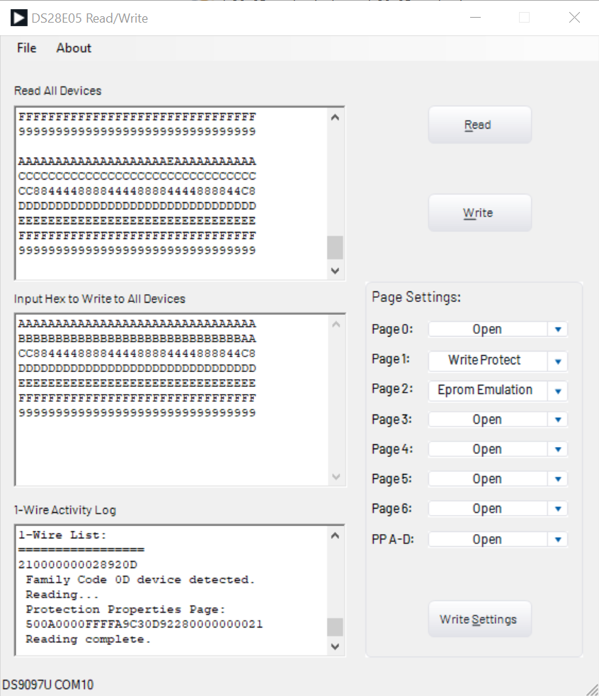

## Description

This is a C# graphical user interface (GUI) for Windows 10 x64, specifically to read and write the [DS28E05](https://www.analog.com/en/products/ds28E05.html) eeprom memory devices. Keep in mind that these devices only work at overdrive speed and thus can only be used in 1-Wire applications where the 1-Wire cabling extends only to a few meters.

## Hardware Requirements
-	A DS28E05 chip (TSOC package is recommended). This software can read or write multiple devices on the same 1-Wire line.
-   An appropriate 1-Wire socket board and cable to hold the DS28E05 package and connect to the PC 1-Wire adapter. For 1-Wire socket boards, see the [DS9120 family of boards](https://www.maximintegrated.com/en/products/interface/controllers-expanders/DS9120.html). They come with an appropriate interconnect cable (RJ12 male-to-male). The DS9120P+ can handle multiple package types, including a TSOC package.
-	A 1-Wire PC adapter.  Use only the [DS9481R-3C7 USB-to-Serial 1-Wire adapter](https://www.maximintegrated.com/en/products/ibutton-one-wire/ibutton/DS9481R-3C7.html). This is due to the fact the DS28E05 only operates at 1.71V to 3.63V.
- Connect the 1-Wire adapter of choice to the PC on a spare USB port. Connect one end of the cable to the adapter and the other end should be connected to the DS24B33 device through a socket board like the above-mentioned DS9120P+. 
 
## Software Development Tools and Dependencies
-	Visual Studio 2017 capable of writing C# programs.
-	[.NET version 4.8 runtime](https://dotnet.microsoft.com/en-us/download/dotnet-framework/net48) pre-installed. If compiling, please install the developer pack.
-	It assumes that the [1-Wire Drivers](https://www.analog.com/en/resources/evaluation-hardware-and-software/1-wire-sdks/drivers.html) have been installed for USB DS9490R adapter support but should work stand-alone without 1-Wire Drivers for the DS9481R-3C7 PC adapter. 
-  Before installing the 1-Wire Drivers, make sure the adapter is unplugged.  For extra 1-Wire Drivers help see this [application note](https://www.analog.com/en/resources/technical-articles/onewireviewer-and-ibutton-quick-start-guide.html).

## Downloading and Running
- From this GitHub page, click the [1-Wire_SDK_Examples](https://github.com/MaximIntegratedTechSupport/1-Wire_SDK_Examples) link and then click the Code button followed by the "Download Zip" option.  Unzip the downloaded file and find the executable and double-click.
  
## Operation or Software Flow
When run, the GUI software will do the following before the main Window appears:
1.	Automatically discover the first 1-Wire adapter it can.  This is done by first looking to see if a DS9490R 1-Wire USB adapter exists on “USB1” (but, again, please do not use the DS9490R).  USB1 is mapped as a copy of the first Windows “handle” to the hardware device that was most recently plugged in. If it doesn’t find one there, it will attempt to find a DS9481R-3C7 serial port 1-Wire adapter on COM1 through COM64. If no adapters are found, the GUI will generate a “MessageBox” error message before the main Window appears and before the Splash Screen is visible (see step 2). Figure 1 shows the error message.

     
 
    *Figure 1.  No Adapter Found Error.*

2.	The GUI will display a splash screen before the main window appears (using the LookAndFeel.dll).  It will appear for 3 seconds and give the name of the software, along with copyright information, version information, and how to contact Analog Devices. It also has a checkbox that a user can check to disable the splash screen as desired. Figure 2 shows the splash screen. To re-enable the splash screen, the user can click the “About” menu item from the main menu of the main GUI window as shown in Figure 3 below. This is the same splash screen but dismisses with a click of the “OK” button.

      	 
 
    Figure 2.  Splash Screen on Startup. 		

      	 
 
    Figure 3. About Screen with OK Button

When the main Window appears, it will contain 3 text edit boxes vertically aligned, along with 2 buttons to go with the read and write events.  See Figure 4 below.

      

   Figure 4.  GUI Main Window

### Reading
The top button is the “read” button.  When clicked, the program discovers all 1-Wire devices connected on the 1-Wire bus, reads the entire user memory contents of the DS28E05 devices, and displays the entire memory contents in hexadecimal form (no spaces) in the topmost text box labeled “Read All Devices”.  See Figure 4 for the Main Window, the button labeled “Read” and the “Read All Devices” text box.  
### Writing
The “Write” button, when clicked, discovers all DS28E05 1-Wire devices and attempts to take the hexadecimal contents that the user places in the middle text box labeled “Input Hex to Write All Devices”, converts the text into an array of bytes and writes this array to all DS28E05 devices found, one at a time. See Figure 4 for the Main Window, the button labeled “Write” and the “Input Hex to Write to All Devices" text box.

### Write Settings
The “Write Settings” button, when clicked, discovers all DS28E05 1-Wire devices and attempts to take the selections in the "Page Settings" box, convert them to 4 bytes (nybble by nybble) and writes these bytes to all DS28E05 devices found, one at a time. Each of the 7 pages of DS28E05 user memory can be set to write protection (no writes can occur), eprom emulation (the bits on the page can only be written from 1 to 0), and open (the user memory can be freely read and written). See Figure 4 for the Main Window, the button labeled “Write Settings” inside the group box labeled "Page Settings". The pages are numbered 0 through 6 with the last page labeled "PP A-D" which stands for Page Protection A-D (the four page protection bytes). The "PP A-D" will either lock the 4 page protection bytes or keep them open (unlocked). Warning:  When Page Protection bytes are written to from "Open" to another setting like "Write Protect" or "Eprom Emulation," the setting is PERMANENT. Switching from "Write Protect" to "Eprom Emulation" or "Open" is not possible (this is by design).

### Other GUI Functions 
1. The Speed group box.  This has two radio buttons that allow the user to choose which 1-Wire speed to choose:  Standard or Overdrive. Standard allows for much longer lines but "Overdrive" can speed up 1-Wire reads and writes.
2. 1-Wire Activity text box.  The text box labeled “1-Wire Activity Log” is the bottom text box.  This displays the 1-Wire activity during the read and write events.  Specifically, it shows the serial numbers of all 1-Wire devices found.  If they are DS28E05 devices, then the text box displays a message that reading is occurring or that writing is occurring.
3.	The Status Bar. This is at the very bottom of the main Window and either displays “No Adapter Found” or the adapter and port, such as “DS9097U COM10” connected to the PC as shown in Figure 4. The "DS9097U" is actually emulated by the DS9481R-3C7, so this is what gets displayed for the DS9481R-3C7.
4.	Main Menu.  See Figure 4. This is located at the top of the main window and consists of “File” and “About” menu items.  When clicking "File", it will present a sub menu item called “Exit”.  Clicking this causes the program to exit cleanly.  Clicking About will cause the “About" screen to appear as shown in Figure 3.

## Limitations
-	Testing was done only on Windows 10 x64.
-	Only DS28E05 devices were tested.
-   No warnings are presented to let the user know if a page could not be written.  It is recommended to read back the contents after a write to visually verify.
-   Only the DS9481R-3C7 1-Wire PC adapter can be safely used to read/write the DS28E05.

