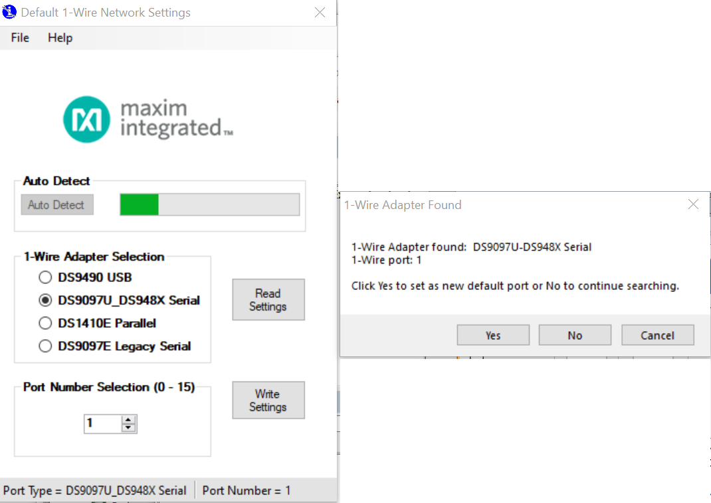
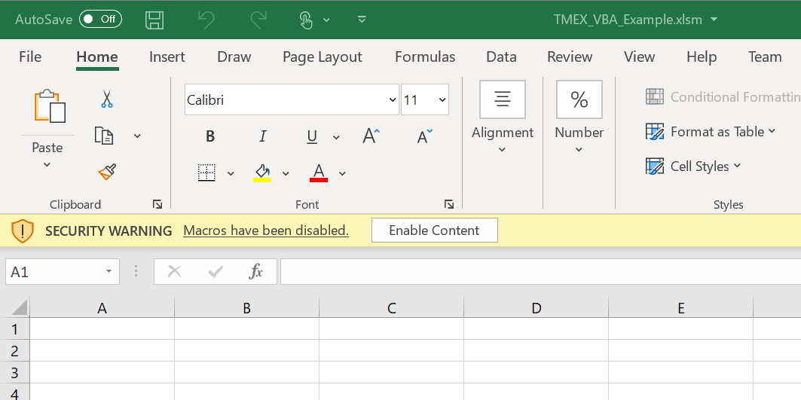
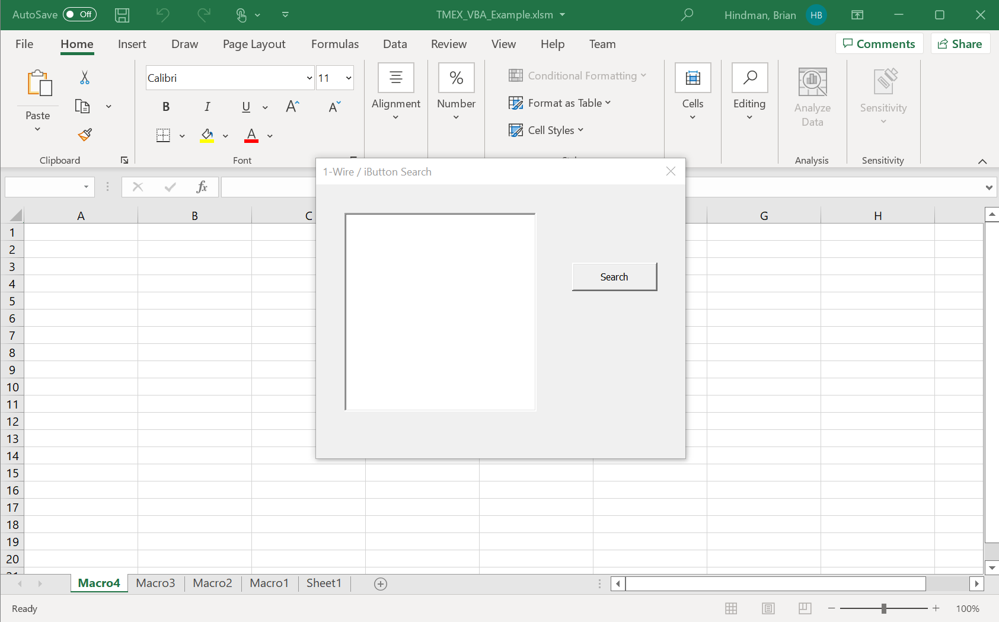
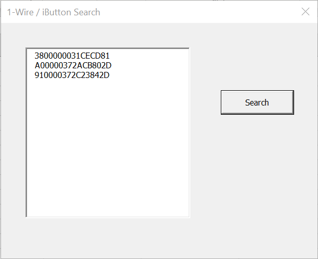

## Description
This is the repository for the 1-Wire search Visual Basic for Applications (VBA) demo. VBA is the computer language behind Microsoft Office. This example exists inside a Microsoft Excel spreadsheet.  It will present a small graphical user interface (GUI) when the spreadsheet is opened that demonstrates 1-Wire Search capability -- this means discovering all 1-Wire devices and displaying their unique serial number (also known as ROM IDs). 

## Hardware Setup 
-	Multiple iButton or 1-Wire devices. For testing purposes in-house, 2 [DS1972](https://www.maximintegrated.com/en/products/ibutton-one-wire/memory-products/DS1972.html) iButton devices were used.
-	A 1-Wire PC adapter.  User either the [DS9490R# USB-to-1-Wire PC adapter](https://www.maximintegrated.com/en/products/ibutton-one-wire/ibutton/DS9490R.html) or the [DS9481R-3C7 USB-to-Serial 1-Wire adapter](https://www.maximintegrated.com/en/products/ibutton-one-wire/ibutton/DS9481R-3C7.html). For testing, both were used.
-	[DS1402D-DR8](https://www.maximintegrated.com/en/products/ibutton-one-wire/ibutton/DS1402D-DR8.html) cable.  This cable holds 2 iButton devices on one end and the other end plugs into the DS9490R.  Or, for 1-Wire devices, it is recommended to use Analog's 1-Wire socket boards, see the [DS9120 family of 1-Wire socket boards](https://www.maximintegrated.com/en/products/interface/controllers-expanders/DS9120.html). They come with an appropriate interconnect cable (RJ12 male-to-male).
-	Connect the 1-Wire adapter of choice to the PC on a spare USB port. Plug in the DS1402D-DR8 cable to the 1-Wire adapter and snap in the iButton devices on the other end.  Or, plug-in the RJ12 male-to-male cable to the 1-Wire adpater and the other end to the 1-Wire socket board with 1-Wire devices connected. 

## Software Development Tools Requirements
-	Microsoft Excel. Testing/Development of the Excel spreadsheet was with the Microsoft 365 version of Excel. 
-   The VBA programmer's IDE of Excel can be opened by double-clicking the spreadsheet and pressing ALT + F11 on the keyboard. See Figure 1 below to see the VBA IDE in Excel open with the 1-Wire Search project.

     

## Software Library Dependencies
-	It is assumed that the [1-Wire Drivers package](https://www.maximintegrated.com/en/products/ibutton-one-wire/one-wire/software-tools/drivers/download-1-wire-ibutton-drivers-for-windows.html) has been installed for 1-Wire adapter support under Windows 10.  The program was written against the 64-bit TMEX API and only works on x64 versions of Windows.

## Downloading and Running
- From this GitHub page, click the [1-Wire_SDK_Examples](https://github.com/MaximIntegratedTechSupport/1-Wire_SDK_Examples) link and then click the Code button followed by the "Download Zip" option.  Unzip the downloaded file and find the Excel file "TMEX_VBA_Example.xlsm" and double-click.

## Operation or Software Flow
1.	Before running the Excel VBA 1-Wire search program, set the 1-Wire default port.  This is done by running the 1-Wire Drivers’ “Default 1-Wire Net.exe” program. See Figure 2 below. The easiest thing to do is to click on the “Auto Detect” button. Once it detects an adapter, it will prompt the user to set the adapter. If the default port is not set, the program assumes DS9490 on port 1.

     

    Figure 2. Setting the Default 1-Wire Adapter and Port.    

2.	Close the “Default 1-Wire Net.exe” program. It doesn’t need to be run again unless the user changes ports or devices. It will also interfere with 1-Wire transactions in the VBA program if the program remains open.
3.	Open the spreadsheet. Macros (including VBA) are usually blocked from running, so the Excel spreadsheet will open a blank worksheet, but it may contain a warning shown in Figure 3. Click “Enable Content” to run the VBA 1-Wire Search window. It is setup to run when the spreadsheet is opened.

     

    Figure 3. Click “Enable Content” to Display the 1-Wire Search Window.    

4.	When the main Window appears, it will contain 1 text box and 1 button labeled “Search”.  That’s all. See Figure 4 below. 

     

    Figure 4. Main Window with Single Button.    

5.	Clicking the Search button will populate the text box with all of the ROM IDs (serial numbers) of 1-Wire devices found.  See Figure 5 below.

     

    Figure 5. Results of Search Button Click. 
 
6.	If no 1-Wire adapters are connected to the PC, and the Search button is clicked, it will generate the following message in the text box: “1-Wire network does not exist”.
7.	The program only runs when the spreadsheet is opened.  But, it can also be run (and debugged) in the VBA IDE on the backend after pressing ALT + F11 on the keyboard.  See Figure 1 above. Click the green triangle to run the VBA program.
 
## Limitations
-	Testing will only be done on Windows 10 x64.
-	It only works on x64 Windows as it links only to the 64-bit TMEX API dll.

## Misc. Notes
- The VBA code is digitally signed.
- The ibtmexbw.bas file is the code module that interfaces to the TMEX API.  It also resides inside the Excel file, but it is provided here for convenience.

